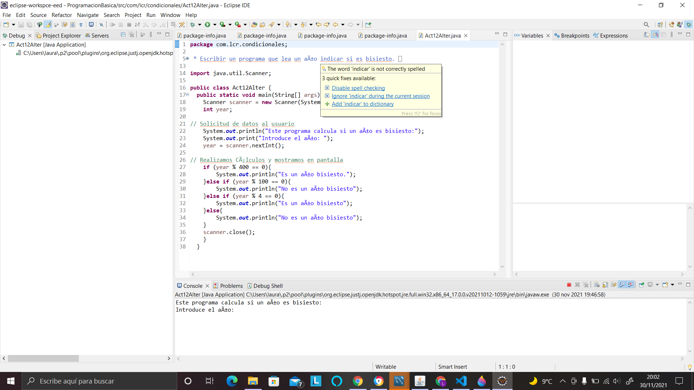
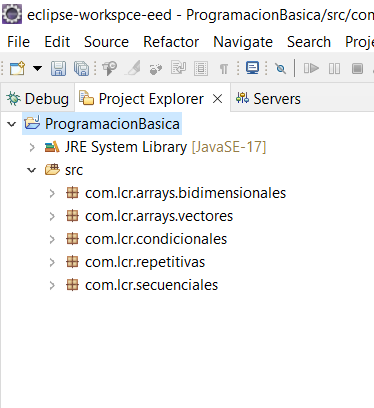
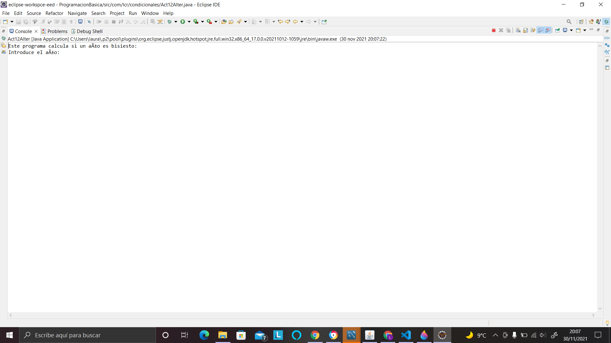
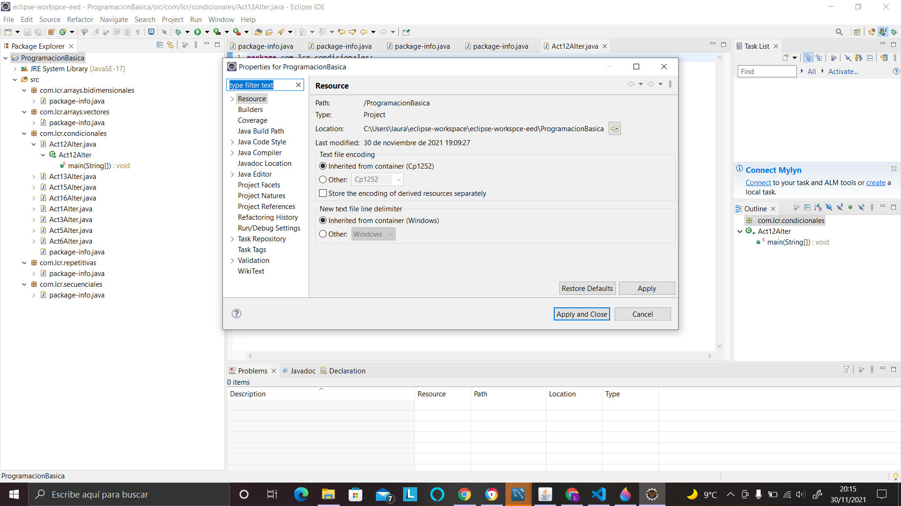
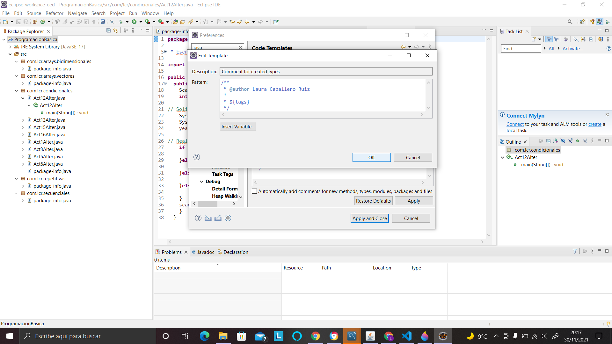
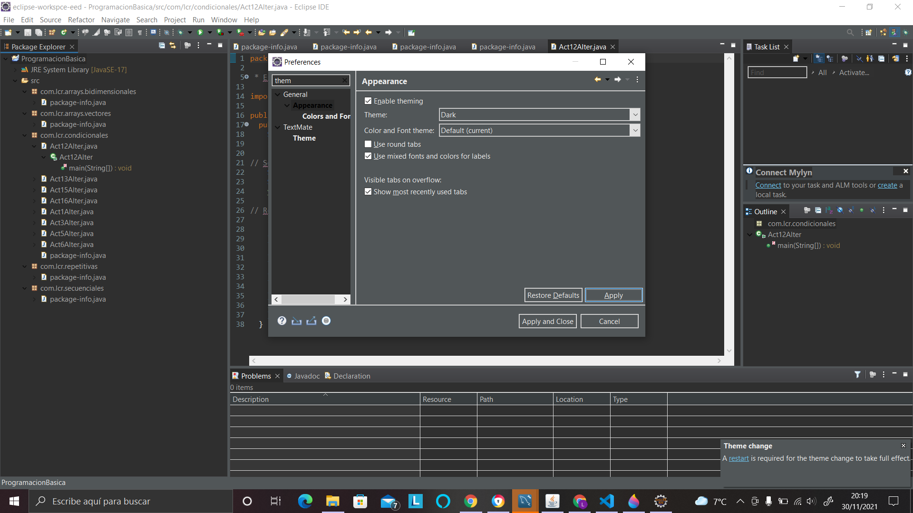
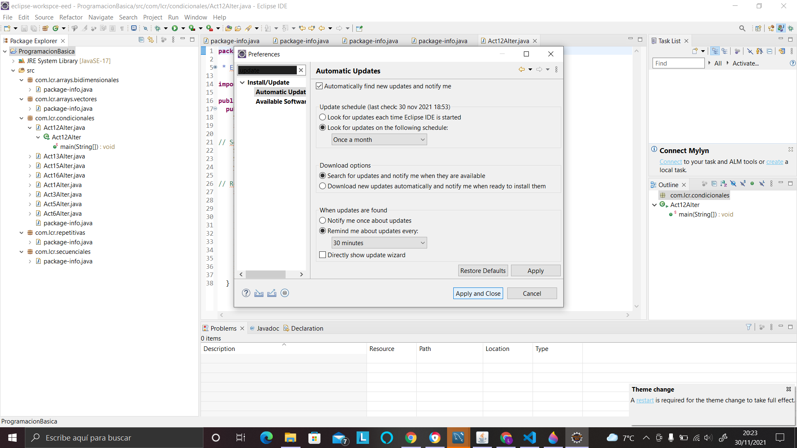

1. Cambia de perspectiva: de Java a Debug

1. Maximiza la vista de paquetes y envía un pantallazo

1. Ejecuta una clase con entrada de datos por teclado. Cambia el tamaño a la vista Consola y envía un pantallazo

1. Resetea la perspectiva de Java a sus valores por defecto.

1. Localiza la ubicación del proyecto en el sistema de ficheros. Envía un pantallazo de las propiedades del proyecto

1. El comentario JavaDoc de una clase genera la etiqueta @author. Modifícala para que aparezca en todos los proyectos tu nombre y dos apellidos

1. Cambia el tema por defecto del IDE.

1. Configura el sistema de actualización del entorno de desarrollo:
